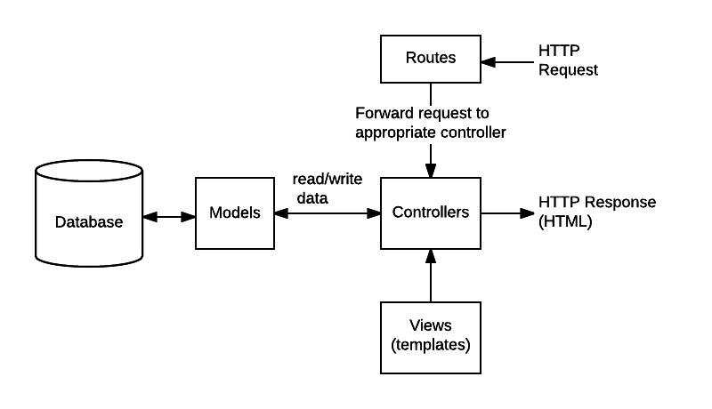

# MDN's Local Library Express Tutorial

[Source](https://developer.mozilla.org/en-US/docs/Learn/Server-side/Express_Nodejs/skeleton_website)

## Run Locally

```sh
# clone this repo
git clone https://github.com/bmilcs/mdn-express-local-library

# change directories
cd mdn-express-local-library

# install dependencies
npm install

# run server
npm run serverstart
```

## Notes

UML association diagram:

- shows models we define in boxes
- shows relationships between models
- shows **multiplicities**: min & max numbers of each model that may be present in the relationship

For example:

- Lines connecting `Book` & `Genre`: shows that they're connected
- Numbers close to `Book`: show a `Genre` must have 0 or more `Books` (as many as you'd like)
- Numbers close to `Genre`: show a `Book` can have zero or more associated genres


Model View Controller in Express



Form Handling Process


